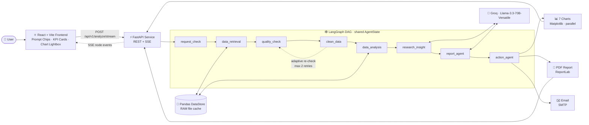

<div align="center">

# 🧠 Enterprise Multi-Agent Business Analyst

### Autonomous Enterprise BI Engine combining deterministic analytics precision with generative AI reasoning

[](https://www.python.org/)
[](https://fastapi.tiangolo.com/)
[](https://react.dev/)
[](https://langchain-ai.github.io/langgraph/)
[](https://groq.com/)
[](#-license)
[](https://github.com/yossef1907/enterprise-multi-agent-analyst/stargazers)
[](https://github.com/yossef1907/enterprise-multi-agent-analyst/commits)

**LangGraph · Groq · FastAPI · React · Pandas · ReportLab**


</div>

---

## 📖 Table of Contents

- [Executive Overview](#-executive-overview)
- [Key Features](#-key-features)
- [System Architecture](#-system-architecture)
- [Agent Pipeline](#-agent-pipeline)
- [Product Tour](#-product-tour)
- [Tech Stack](#-tech-stack)
- [Quickstart & Local Installation](#-quickstart--local-installation)
- [API Endpoints Reference](#-api-endpoints-reference)
- [Engineering Notes](#-engineering-notes)
- [Roadmap](#-roadmap)
- [Author](#-author)
- [License](#-license)

---

## 🎯 Executive Overview

Large language models are excellent at interpretation and poor at arithmetic. Ask an LLM to total twenty thousand orders and it may produce a fluent, confident, and wrong answer. Business intelligence cannot tolerate that.

**Enterprise Multi-Agent Business Analyst** solves this trade-off by splitting the work into two layers:

| Layer | Technology | Responsibility |
| --- | --- | --- |
| 🔢 **Deterministic Analytics** | Python · Pandas | Every number: revenue, orders, average order value, unique customers, products. Calculated in memory, never delegated to the model. |
| 💬 **Generative Reasoning** | Llama-3.3-70B-Versatile via Groq | Interpretation of the verified numbers: summaries, strategic recommendations, and an executive narrative tailored to the user's question. |

> **Design principle:** the LLM interprets verified analytical results. It is never trusted with core numerical calculations.

A [LangGraph](https://langchain-ai.github.io/langgraph/) pipeline of eight specialized nodes takes a plain-English business question from raw data to validated KPIs, AI insights, seven charts, an executive PDF, and an email draft, while streaming every step to the UI in real time.

---

## ✨ Key Features

- ⚡ **Deterministic Financial Engine**: Exact, reproducible calculation of Revenue, Order Volume, Average Order Value (AOV), Unique Customers, and SKU/returns handling, all computed with Pandas.
- 🤖 **LangGraph 8-Node DAG**: State-driven orchestration through `request_check`, `data_retrieval`, `quality_check`, `clean_data`, `data_analysis`, `research_insight`, `report_agent`, and `action_agent`, sharing a single `AgentState`.
- 📡 **Real-time SSE Streaming**: Live Server-Sent Events show which node is active and how far execution has progressed.
- 🎨 **Enterprise Glassmorphic Dashboard**: Dark-mode React UI with quick-action Prompt Chips, glowing KPI cards, a live KPI ticker, and an interactive Chart Lightbox with zoom.
- 📊 **Parallel Chart Engine**: Generates 7 analytics charts in parallel, served with cache-busting URLs so the browser never shows stale images.
- 📄 **Automated PDF & Email Dispatch**: ReportLab builds the executive PDF, and SMTP delivers it as an email attachment.
- 🚀 **Cross-Run File Memory Cache**: The dataset is cached in RAM after the first load, so repeated analyses skip the disk read entirely.
- 🛡️ **Resilient by Design**: Adaptive quality retries, a no-API-key fallback for the executive report, and a path-traversal-guarded fallback route for chart files.

---

## 🏗️ System Architecture



### Layered Design

| # | Layer | Technology | Responsibility |
| --- | --- | --- | --- |
| 1 | **Presentation** | React 18 · Vite · Tailwind CSS · Lucide Icons | Glassmorphic UI, prompt chips, live step tracking, chart gallery with zoom lightbox |
| 2 | **API & Streaming** | FastAPI v1.3.0 · Uvicorn | REST endpoints, SSE streaming, static chart mount, safe chart fallback route |
| 3 | **Orchestration** | LangGraph `StateGraph` (DAG) | 8 sequential and conditional nodes, shared `AgentState`, retry logic, adaptive routing |
| 4 | **Data & AI** | Pandas · ChatGroq · Matplotlib · ReportLab · SMTP | RAM-cached DataFrame, LLM reasoning, chart rendering, PDF generation, email delivery |

---

## 🔬 Agent Pipeline

Each node has a single responsibility and passes its results forward through `AgentState`.

| # | Node | Responsibility |
| --- | --- | --- |
| 1 | `request_check` | Validates the user query and request parameters |
| 2 | `data_retrieval` | Locates and loads the sales dataset (Excel/CSV) into memory, using the file cache after the first run |
| 3 | `quality_check` | Checks core column structure, dates, damaged quantities, and negative prices |
| 4 | `clean_data` | Normalizes and deduplicates the DataFrame, keeps returns (negative quantities), filters negative prices |
| 5 | `data_analysis` | Computes deterministic KPIs: revenue, orders, AOV, unique customers, products |
| 6 | `research_insight` | Calls Llama-3.3-70B to generate categorized strategic insights guided by the user's prompt |
| 7 | `report_agent` | Synthesizes a focused three-part executive summary: Headline → Dynamic Insights → Strategic Advice |
| 8 | `action_agent` | Renders 7 charts in parallel, builds the PDF, and drafts and sends the email |

<details>
<summary><b>🖼️ See the live agent pipeline panel</b></summary>

<br/>

<div align="center">

</div>

The sidebar shows each of the eight nodes as it runs, along with six one-click prompt chips: *Revenue Overview*, *Top Products & Returns*, *Regional Distribution*, *AOV Optimization*, *Customer Segmentation*, and *Anomaly Detection*.

</details>

---

## 🖥️ Product Tour

Below is a real run against the *Online Retail* dataset (2010-12-01 to 2011-12-09) using the prompt:

> *"Analyze total sales revenue, order trends, and present key executive recommendations"*

| KPI | Result |
| --- | --- |
| **Total Revenue** | $10,642,110.80 |
| **Total Orders** | 20,726 |
| **Average Order Value** | $513.47 |
| **Unique Customers** | 4,339 |
| **Distinct Product SKUs** | 3,941 |

### 📊 Seven Generated Charts

1. Monthly Revenue Trend
2. Top 10 Countries by Revenue
3. Monthly Unique Orders
4. Top 10 Products by Revenue
5. Order Revenue Distribution
6. Executive KPI Summary (table)
7. Daily Revenue (7-day rolling average)

<details>
<summary><b>📝 Executive Summary output</b></summary>

<br/>


</details>

<details>
<summary><b>✉️ Email summary draft</b></summary>

<br/>

<div align="center">

</div>

</details>

---

## 🧰 Tech Stack

| Category | Technologies |
| --- | --- |
| 🎨 **Frontend** | React 18, Vite, Tailwind CSS, Lucide Icons |
| ⚙️ **Backend** | Python 3.10+, FastAPI, Uvicorn (async), Server-Sent Events |
| 🤖 **AI Orchestration** | LangGraph (`StateGraph`), LangChain, ChatGroq with Llama-3.3-70B-Versatile |
| 🧮 **Data Processing** | Pandas, in-memory `DataStore` file cache, Matplotlib |
| 📦 **Reports & Delivery** | ReportLab (PDF), SMTP (email with attachment) |

---

## 🚀 Quickstart & Local Installation

### Prerequisites

- **Python 3.10+**
- **Node.js 18+** and npm
- A free [Groq API key](https://console.groq.com/keys)
- *(Optional)* SMTP credentials for email delivery
- The sales dataset, `Online Retail.xlsx`

### 1️⃣ Clone the repository

```bash
git clone https://github.com/yossef1907/enterprise-multi-agent-analyst.git
cd enterprise-multi-agent-analyst
```

### 2️⃣ Set up the backend

```bash
# Create and activate a virtual environment
python -m venv .venv

# macOS / Linux
source .venv/bin/activate
# Windows (PowerShell)
.venv\Scripts\Activate.ps1

# Install the backend in editable mode
pip install -e .
```

### 3️⃣ Configure environment variables

Create a `.env` file in the project root:

```env
# Required for AI-generated insights
GROQ_API_KEY=your_groq_api_key_here

# Optional: required only for automated email delivery
SMTP_HOST=smtp.gmail.com
SMTP_PORT=587
SMTP_USER=your_email@example.com
SMTP_PASSWORD=your_app_password
SMTP_TO=recipient@example.com
```

> 💡 **No Groq key?** The report agent includes an automatic fallback, so the pipeline still completes. The executive summary just won't use the LLM.

### 4️⃣ Add the dataset

Place `Online Retail.xlsx` in the `data/` directory. The first run loads it from disk (about 2 minutes for the 23 MB file); every later run reads it from the RAM cache in under 0.01 s.

### 5️⃣ Start the backend

```bash
uvicorn main:app --reload --host 127.0.0.1 --port 8000
```

Verify it is running:

```bash
curl http://127.0.0.1:8000/health
```

### 6️⃣ Start the frontend

Open a second terminal:

```bash
cd frontend
npm install
npm run dev
```

Open the URL printed by Vite (typically **http://localhost:5173**), type a business question or click a Prompt Chip, and press **Execute Multi-Agent Analysis**.

---

## 🔌 API Endpoints Reference

Base URL: `http://127.0.0.1:8000`

| Endpoint | Method | Description |
| --- | --- | --- |
| `/api/v1/analyze/stream` | `POST` (SSE) | Runs the full pipeline and streams node and step events in real time |
| `/charts/{filename}` | `GET` | Static mount serving the generated chart images |
| `/api/v1/charts/{filename}` | `GET` | Fallback chart route that reads from disk, protected by a path-traversal guard |
| `/api/v1/download-pdf` | `GET` | Downloads the generated executive PDF report as an attachment |
| `/api/v1/analyze` | `POST` | Runs the full analysis and returns the result as a single JSON response |
| `/health` | `GET` | Health check, returns server status and version (v1.3.0) |

<details>
<summary><b>📡 Example: consume the SSE stream</b></summary>

<br/>

```bash
curl -N -X POST http://127.0.0.1:8000/api/v1/analyze/stream \
  -H "Content-Type: application/json" \
  -d '{"query": "Analyze total sales revenue, order trends, and present key executive recommendations"}'
```

```javascript
// Browser example using fetch and a stream reader
const res = await fetch("http://127.0.0.1:8000/api/v1/analyze/stream", {
  method: "POST",
  headers: { "Content-Type": "application/json" },
  body: JSON.stringify({ query: "Revenue overview" }),
});

const reader = res.body.getReader();
const decoder = new TextDecoder();
while (true) {
  const { done, value } = await reader.read();
  if (done) break;
  console.log(decoder.decode(value)); // one SSE event per pipeline step
}
```

</details>

---

## 🛠️ Engineering Notes

Real problems solved while building this system:

| Challenge | Solution |
| --- | --- |
| Charts failed to load (HTTP 400/404) | `base_url` was returned as an invalid Markdown link; it is now a plain string (`http://127.0.0.1:8000/charts`) |
| Stale charts after restart | A unique timestamp is appended to chart URLs (`?t=Date.now()`) to defeat browser caching |
| No safe direct access to chart files | Added `/api/v1/charts/{filename}` with a path-traversal guard |
| Repetitive, static executive reports | `user_query` is wired into the Llama prompt, and `report_agent` produces a focused three-part narrative with an automatic fallback |
| ≈120 s dataset load on every run | `DataStore._FILE_CACHE` keeps the DataFrame in RAM, cutting repeat loads to under 0.01 s |

> ⚡ **Performance:** repeated dataset access dropped from **≈120 seconds** to **under 0.01 seconds**.

---

## 🗺️ Roadmap

- [ ] 📤 **Custom Dataset Upload**: upload your own Excel/CSV files directly from the React UI
- [ ] 💬 **Multi-Turn Conversational Memory**: extend the LangGraph checkpointer for follow-up questions
- [ ] 📈 **Predictive Forecasting**: sales trend prediction with Prophet or ARIMA
- [ ] 🐳 **Docker & Cloud Deployment**: Dockerfile for one-click cloud deployment

---

## 👨‍💻 Author

**Yossef Ayman Nasef**

Software Engineering student focused on Generative AI and Agentic AI development.

[](https://github.com/yossef1907)

---

## 📜 License

This project is licensed under the **MIT License**.

```text
MIT License

Copyright (c) 2026 Yossef Ayman Nasef

Permission is hereby granted, free of charge, to any person obtaining a copy
of this software and associated documentation files (the "Software"), to deal
in the Software without restriction, including without limitation the rights
to use, copy, modify, merge, publish, distribute, sublicense, and/or sell
copies of the Software, and to permit persons to whom the Software is
furnished to do so, subject to the following conditions:

The above copyright notice and this permission notice shall be included in all
copies or substantial portions of the Software.

THE SOFTWARE IS PROVIDED "AS IS", WITHOUT WARRANTY OF ANY KIND, EXPRESS OR
IMPLIED, INCLUDING BUT NOT LIMITED TO THE WARRANTIES OF MERCHANTABILITY,
FITNESS FOR A PARTICULAR PURPOSE AND NONINFRINGEMENT. IN NO EVENT SHALL THE
AUTHORS OR COPYRIGHT HOLDERS BE LIABLE FOR ANY CLAIM, DAMAGES OR OTHER
LIABILITY, WHETHER IN AN ACTION OF CONTRACT, TORT OR OTHERWISE, ARISING FROM,
OUT OF OR IN CONNECTION WITH THE SOFTWARE OR THE USE OR OTHER DEALINGS IN THE
SOFTWARE.
```

<div align="center">

⭐ If this project helps you, consider giving it a star on [GitHub](https://github.com/yossef1907/enterprise-multi-agent-analyst).

</div>
